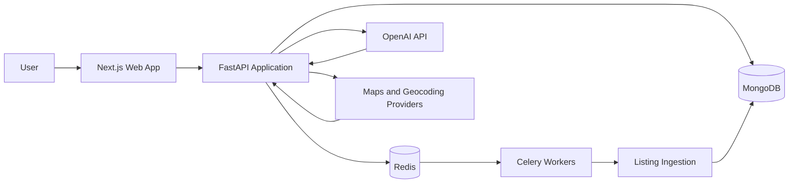

# AI Relocation Intelligence

<p align="center">
  <strong>An AI-powered decision platform for choosing where to live near work.</strong>
</p>

<p align="center">
  
  
  
  
  
  
</p>

## The problem

Finding a rental home is usually treated as a listing-search problem. In practice, people need to balance rent, commute, safety, internet reliability, neighbourhood quality, and personal preferences at the same time.

AI Relocation Intelligence turns that multi-factor decision into a guided search experience. A user can describe what matters in natural language and compare places using structured locality, rental, commute, and community signals.

## What the platform does

- Understands natural-language relocation requirements
- Aggregates and normalises rental listings
- Estimates office commute and locality suitability
- Builds AI-generated locality summaries
- Captures real rent feedback and neighbourhood signals
- Compares multiple properties and localities
- Supports ingestion workflows for keeping listing data fresh

## Architecture



### Main components

| Layer | Responsibility |
|---|---|
| Next.js frontend | Search, assistant, comparison, property and locality experiences |
| FastAPI backend | API orchestration, validation, recommendation and assistant endpoints |
| MongoDB | Properties, localities, commute data, feedback and AI summaries |
| Redis + Celery | Background ingestion and asynchronous processing |
| AI layer | Natural-language interpretation and locality recommendation support |
| Map providers | Geocoding, map rendering and commute-related location context |

## Repository structure

```text
frontend/    Next.js application
backend/     FastAPI services, schemas, routes and workers
docs/        Provider notes and project documentation
```

## Implemented foundation

- Typed MongoDB and Pydantic models
- Search, property, locality, commute, feedback and assistant routes
- Landing, search, assistant, comparison and detail pages
- Seed data for Kolkata localities
- Playwright-based Housing.com ingestion workflow
- Environment-based configuration for local development

## Technical decisions

### Structured data before AI output

The assistant works on top of typed property and locality records rather than relying only on free-form model responses. This keeps recommendations easier to explain and improves the path toward evaluation and ranking.

### Background ingestion

Rental data collection can be slow and failure-prone. Redis and Celery separate ingestion work from interactive API requests so the user-facing application remains responsive.

### Provider abstraction

Maps, geocoding and property sources are treated as replaceable providers. This allows the project to start with accessible APIs and later move to partner feeds or paid providers without rewriting the full application.

## Run locally

### Requirements

- Node.js
- Python 3.11+
- MongoDB on `localhost:27017`
- Redis on `localhost:6379`

### Backend

```bash
cd backend
python -m venv .venv
pip install -r requirements.txt
uvicorn app.main:app --reload
```

### Frontend

```bash
cd frontend
npm install
npm run dev
```

### Environment

Copy the example files and provide the keys needed by your setup:

```bash
cp .env.example .env
cp backend/.env.example backend/.env
cp frontend/.env.example frontend/.env.local
```

Important variables include:

- `OPENAI_API_KEY`
- `GOOGLE_MAPS_API_KEY`
- `MAPBOX_ACCESS_TOKEN`
- `NEXT_PUBLIC_MAPBOX_ACCESS_TOKEN`

Never commit real credentials or browser storage-state files.

## Listing ingestion

```bash
python backend/scripts/populatePropertyData.py --city "Kolkata"
```

Useful options:

```text
--search-url <url>
--max-pages <number>
--headful
--dry-run
--no-deactivate-stale
--storage-state <file>
```

Example scheduled execution:

```bash
0 */6 * * * cd /path/to/repo && /path/to/python backend/scripts/populatePropertyData.py --city "Kolkata"
```

## Current roadmap

- Recommendation scoring and evaluation
- Saved searches and alerts
- Better locality and commute evidence
- Personalisation
- Community and roommate features
- Deployment, observability and automated tests

## Responsible use

Housing recommendations can affect important personal decisions. Outputs should be treated as decision support, not as guarantees. Safety, price and neighbourhood information should be verified through trusted sources before acting.

## Author

Built by [Dedipya Goswami](https://github.com/dedipya001) as a full-stack and applied-AI product project.
