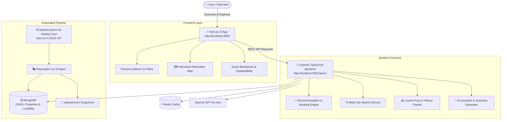

# 🌆 AI Relocation Intelligence

<p align="center">
  <strong>An AI-powered multi-factor decision & recommendation platform for choosing where to live near work.</strong>
</p>

<p align="center">
  <a href="https://github.com/dedipya001/AI-Relocation-Assistant/actions/workflows/ci.yml"></a>
  
  
  
  
  
  
  
</p>

---

## 🎯 The Problem

Finding a rental home is usually treated as a keyword or listing-filter search. In reality, relocating involves balancing **rent, commute time, safety, internet reliability, food access, and lifestyle fit** under personal constraints.

**AI Relocation Intelligence** turns this multi-factor challenge into a guided, explainable decision platform. Users can search naturally, filter by pre-tuned relocation personas, inspect composite score breakdowns with full mathematical transparency, and explore interactive property maps across major Indian tech corridors.

---

## 🚀 Key Features

- **🧠 Multi-Factor Recommendation Engine**:
  - Deterministic 7-factor scoring model: *Affordability*, *Commute & Proximity*, *Neighbourhood Safety*, *Internet Reliability*, *Food & Essentials*, *Lifestyle Fit*, and *Property Quality*.
  - Configurable user personas: `balanced`, `budget_saver`, `tech_professional`, `safety_priority`, `family_first`, and `night_owl`.
  - Hard constraint boundary enforcement (`max_budget`, `max_commute_minutes`, `min_safety_score`, `min_internet_score`, `must_have_amenities`).
  - Explainable subscores with itemized weight contributions and narrative decision reasoning.

- **🗺️ Zero-Config Interactive Maps**:
  - Out-of-the-box map visualization using CartoDB Voyager & OpenStreetMap raster tiles (zero API keys required).
  - Mapbox GL integration with isochrone commute rings (10/20/30 min travel contours) and directional driving routes.
  - Interactive property markers with hover price cards, metro tags, and auto-centering bounds.

- **🤖 Automated Ingestion & Scraper Pipeline**:
  - Resilient Playwright headless scraper extracting Schema.org `application/ld+json` microdata and high-res DOM elements without bot blocks.
  - Handles multi-unit INR rent denominations (`k`, `Lac`, `Lakh`, `Cr`) with residential outlier filters.
  - SHA-1 deterministic deduplication and timestamped price fluctuation tracking in `price_history`.
  - Automated bi-weekly GitHub Actions workflow running on Mondays & Fridays at 08:30 AM IST.

- **🏙️ Multi-City Coverage**:
  - **Kolkata**: Salt Lake City, Sector V, New Town, Rajarhat, Ballygunge, EM Bypass.
  - **Bengaluru**: Whitefield, Electronic City, HSR Layout, Koramangala, Bellandur, Indiranagar.
  - **Mumbai**: Powai, Andheri East, Bandra West, Goregaon East, Thane West.
  - **Pune**: Hinjewadi, Wakad, Baner, Kharadi, Viman Nagar, Magarpatta.

---

## 🏗️ Architecture



---

## 📂 Project Structure

```text
AI-Relocation-Assistant/
├── .github/
│   └── workflows/
│       ├── ci.yml                     # Continuous integration & test suite
│       └── scrape-properties.yml      # Bi-weekly automated property ingestion cron
├── backend/                           # Express TypeScript API server
│   ├── scripts/
│   │   ├── populatePropertyData.ts    # Live Playwright microdata scraper & DB sync
│   │   ├── importMagicBricksDataset.ts# Multi-city batch dataset importer + geocache
│   │   └── seed.ts                    # Default seed localities and properties
│   └── src/
│       ├── api/v1/                    # Express REST endpoints
│       ├── core/                      # Config & application logging
│       ├── db/                        # MongoDB client & connections
│       ├── models/                    # TypeScript interfaces & Zod validation schemas
│       ├── repositories/              # MongoDB data access layers (properties, localities)
│       └── services/                  # Recommendation engine, commute, search, OpenAI
├── datasetJson/                       # Verified date-stamped property datasets
├── docs/                              # Architecture specifications & API references
└── frontend/                          # Next.js Web Application
    ├── app/                           # App router pages
    ├── components/                    # UI components, modals, maps
    ├── lib/                           # API client & demo fallback fixtures
    ├── store/                         # Zustand state management
    └── types/                         # Shared TypeScript interfaces
```

---

## 🛠️ Getting Started (Local Development)

### 1. Prerequisites
- **Node.js**: v20.x or v22.x
- **MongoDB**: Running locally on `mongodb://localhost:27017`
- **Redis**: Running on `redis://localhost:6379/0`

### 2. Clone and Setup Environment

```bash
git clone https://github.com/dedipya001/AI-Relocation-Assistant.git
cd AI-Relocation-Assistant

cp .env.example .env
cp backend/.env.example backend/.env
cp frontend/.env.example frontend/.env.local
```

### 3. Install & Start Backend

```bash
npm --prefix backend install
npm --prefix backend run seed
npm --prefix backend run dev
```

### 4. Install & Start Frontend

```bash
npm --prefix frontend install
npm --prefix frontend run dev
```

Open **http://localhost:3000** in your browser to start exploring properties.

---

## 📡 REST API Reference

| Method | Endpoint | Description |
|---|---|---|
| `GET` | `/api/v1/properties` | Search and filter properties by city, rent budget, and property type. |
| `GET` | `/api/v1/properties/:id` | Get individual property with price history and locality signals. |
| `POST` | `/api/v1/recommendations/rank` | Multi-factor recommendation ranking with persona weight overrides and hard constraints. |
| `GET` | `/api/v1/recommendations/profiles` | List available scoring personas. |
| `POST` | `/api/v1/search` | Natural language relocation search with candidate retrieval. |
| `GET` | `/api/v1/localities` | List locality metadata, safety ratings, internet scores, and transit connectivity. |
| `POST` | `/api/v1/commute/estimate` | Estimate commute durations between origins and work destinations. |
| `POST` | `/api/v1/assistant/chat` | AI conversational relocation advisory with context-augmented answers. |

---

## 🧪 Verification & Testing

The CI workflow runs on every pull request and every push to `main`. It starts isolated MongoDB and Redis services, seeds the test database, starts the Express API, and runs the complete backend/frontend verification set.

Run the same checks locally from the repository root:

```bash
# Install exact locked dependencies
npm --prefix backend ci
npm --prefix frontend ci

# Backend static verification
npm --prefix backend run typecheck

# Integration-test prerequisites (MongoDB + Redis must be running)
npm --prefix backend run seed
API_PORT=8001 npm --prefix backend run dev

# In another terminal
API_URL=http://127.0.0.1:8001 npm --prefix backend test
npm --prefix backend run test:bench

# Frontend verification
npm --prefix frontend run typecheck
npm --prefix frontend run build
```

---

## ⏰ Data Ingestion Scripts

```bash
npm --prefix backend run import-dataset
npm --prefix backend run scrape-housing -- --city "Kolkata" --max-pages 2
npm --prefix backend run scrape-housing -- --city "Bangalore" --export-json "../datasetJson/bangalore_recent.json"
```

---

## 🗺️ Project Roadmap

- [x] **Recommendation Ranking Engine & Personas** ([#2](https://github.com/dedipya001/AI-Relocation-Assistant/issues/2))
- [x] **Automated Bi-Weekly Property Ingestion Pipeline** ([#13](https://github.com/dedipya001/AI-Relocation-Assistant/issues/13))
- [x] **Multi-City Support for Bengaluru, Mumbai, Pune & Kolkata** ([#11](https://github.com/dedipya001/AI-Relocation-Assistant/issues/11))
- [ ] **Interactive Commute Isochrones & Transit Overlays** ([#8](https://github.com/dedipya001/AI-Relocation-Assistant/issues/8))
- [ ] **Side-by-Side Property & Locality Comparison Matrix UI** ([#9](https://github.com/dedipya001/AI-Relocation-Assistant/issues/9))
- [ ] **Community Rental Feedback & Negotiation Submissions** ([#10](https://github.com/dedipya001/AI-Relocation-Assistant/issues/10))
- [ ] **Saved Searches & Shareable Relocation Shortlists** ([#12](https://github.com/dedipya001/AI-Relocation-Assistant/issues/12))
- [ ] **Dockerized Multi-Stage Development Environment** ([#4](https://github.com/dedipya001/AI-Relocation-Assistant/issues/4))

---

## 🤝 Contributing

We welcome contributions from developers, data engineers, and designers!

1. Fork the repository and create your feature branch (`git checkout -b feat/my-new-feature`).
2. Pick an open issue from the [Roadmap Issues](https://github.com/dedipya001/AI-Relocation-Assistant/issues).
3. Ensure all CI-equivalent verification commands above pass.
4. Commit your changes with clear semantic commit messages.
5. Submit a Pull Request describing your implementation and linking the issue.

---

## 📄 License & Attribution

Built with ❤️ by [Dedipya Goswami](https://github.com/dedipya001). Released under the MIT License.
