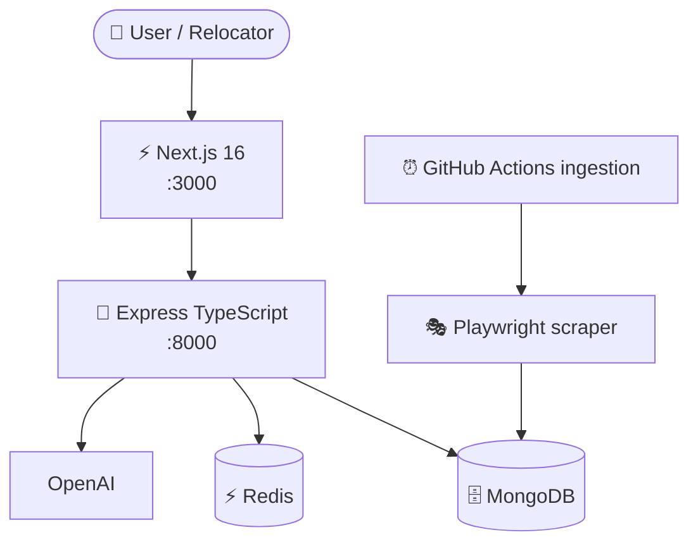

# 🌆 AI Relocation Intelligence

<p align="center">
  <strong>An AI-powered multi-factor decision & recommendation platform for choosing where to live near work.</strong>
</p>

<p align="center">
  <a href="https://github.com/dedipya001/AI-Relocation-Assistant/actions/workflows/ci.yml"></a>
  
  
  
  
  
  
  
</p>

---

## 🎯 The Problem

Finding a rental home is usually treated as a keyword or listing-filter search. In reality, relocating involves balancing **rent, commute time, safety, internet reliability, food access, and lifestyle fit** under personal constraints.

**AI Relocation Intelligence** turns this multi-factor challenge into a guided, explainable decision platform. Users can search naturally, filter by pre-tuned relocation personas, inspect composite score breakdowns with full mathematical transparency, and explore interactive property maps across major Indian tech corridors.

---

## 🚀 Key Features

- **🧠 Multi-Factor Recommendation Engine**
  - Deterministic 7-factor scoring: affordability, commute, safety, internet, essentials, lifestyle, and property quality.
  - Personas: `balanced`, `budget_saver`, `tech_professional`, `safety_priority`, `family_first`, and `night_owl`.
  - Hard constraints for budget, commute, safety, internet, and must-have amenities.
  - Explainable score contributions and decision reasoning.
- **🗺️ Interactive Maps**
  - CartoDB Voyager/OpenStreetMap zero-key map fallback.
  - Mapbox integration for commute visualization and routes.
  - Interactive property markers, metro context, and automatic bounds.
- **🤖 Automated Property Ingestion**
  - Playwright-based marketplace ingestion with Schema.org extraction.
  - INR normalization, deterministic deduplication, and price-history tracking.
  - Automated scheduled ingestion through GitHub Actions.
- **🏙️ Multi-City Coverage**
  - Kolkata, Bengaluru, Mumbai, and Pune datasets and locality coverage.

---

## 🏗️ Architecture



---

## 📂 Project Structure

```text
AI-Relocation-Assistant/
├── .github/workflows/                # CI and ingestion automation
├── backend/
│   ├── Dockerfile                    # Development + production backend targets
│   ├── scripts/                      # Seed, ingestion, tests, benchmarks
│   └── src/                          # Express API, services, repositories, models
├── frontend/
│   ├── Dockerfile                    # Development + standalone production targets
│   ├── app/                          # Next.js app-router pages
│   ├── components/                   # Search, map, property, locality UI
│   └── store/                        # Zustand state
├── datasetJson/                      # Versioned property snapshots
├── docs/                             # Architecture and provider documentation
├── docker-compose.yml                # Live-reload development stack
└── docker-compose.prod.yml           # Production-like stack
```

---

## 🐳 Docker Quick Start

Docker is the recommended setup because it runs the frontend, backend, MongoDB, and Redis with one command. Copy the root environment template first and put any optional provider/API credentials in `.env`; Compose reads that file automatically.

```bash
cp .env.example .env

docker compose up --build
```

The development stack mounts `backend/` and `frontend/` into their containers for live reload. MongoDB is seeded only when its locality collection is empty, so normal restarts do not overwrite existing data.

Open the frontend at **http://localhost:3000** and the backend health endpoint at **http://localhost:8000/health**.

Useful development commands:

```bash
# Follow one service
docker compose logs -f backend
docker compose logs -f frontend

# See all running services
docker compose ps

# Rebuild after Dockerfile/dependency changes
docker compose up --build

# Stop containers but keep Mongo/Redis data
docker compose down

# Stop and remove local database/cache volumes too
docker compose down -v
```

For the production-style stack, both application services are built from their production stages and the Next.js standalone server is used:

```bash
docker compose -f docker-compose.prod.yml up --build -d
docker compose -f docker-compose.prod.yml ps
docker compose -f docker-compose.prod.yml logs -f backend
docker compose -f docker-compose.prod.yml down
```

Environment secrets are never baked into the repository. Configure values such as `OPENAI_API_KEY`, `MAPBOX_ACCESS_TOKEN`, `NEXT_PUBLIC_MAPBOX_ACCESS_TOKEN`, proxy credentials, and deployment URLs in the root `.env` before startup.

---

## 🛠️ Native Local Development

If you prefer to run services directly on the host, install Node.js 20/22, MongoDB, and Redis, then:

```bash
git clone https://github.com/dedipya001/AI-Relocation-Assistant.git
cd AI-Relocation-Assistant
cp .env.example .env
cp backend/.env.example backend/.env
cp frontend/.env.example frontend/.env.local

npm --prefix backend install
npm --prefix frontend install
npm --prefix backend run seed
npm --prefix backend run dev
```

In another terminal:

```bash
npm --prefix frontend run dev
```

---

## 📡 REST API Reference

| Method | Endpoint | Description |
|---|---|---|
| `GET` | `/api/v1/properties` | Search and filter properties by city, rent budget, and property type. |
| `GET` | `/api/v1/properties/:id` | Get one property with price history and locality signals. |
| `POST` | `/api/v1/recommendations/rank` | Rank candidates with persona weights and hard constraints. |
| `GET` | `/api/v1/recommendations/profiles` | List available scoring personas. |
| `POST` | `/api/v1/search` | Natural-language relocation search. |
| `GET` | `/api/v1/localities` | List locality metadata and quality signals. |
| `POST` | `/api/v1/commute/estimate` | Estimate commute duration. |
| `POST` | `/api/v1/assistant/chat` | Conversational relocation advisory. |

---

## 🧪 Verification & Testing

CI runs on every pull request and push to `main`. It provisions isolated MongoDB/Redis services, runs backend type checking, seeds and exercises the API integration suite, runs deterministic recommendation benchmarks, typechecks/builds Next.js, validates both Compose files, and builds both production Docker images.

```bash
npm --prefix backend ci
npm --prefix frontend ci
npm --prefix backend run typecheck

# With MongoDB + Redis running:
npm --prefix backend run seed
API_PORT=8001 npm --prefix backend run dev
# in another terminal:
API_URL=http://127.0.0.1:8001 npm --prefix backend test
npm --prefix backend run test:bench

npm --prefix frontend run typecheck
npm --prefix frontend run build

docker compose -f docker-compose.yml config --quiet
docker compose -f docker-compose.prod.yml config --quiet
docker build --target production -t ai-relocation-backend:test ./backend
docker build --target production -t ai-relocation-frontend:test ./frontend
```

---

## ⏰ Data Ingestion Scripts

```bash
npm --prefix backend run import-dataset
npm --prefix backend run scrape-housing -- --city "Kolkata" --max-pages 2
npm --prefix backend run scrape-housing -- --city "Bangalore" --export-json "../datasetJson/bangalore_recent.json"
```

---

## 🗺️ Project Roadmap

- [x] **Recommendation Ranking Engine & Personas** ([#2](https://github.com/dedipya001/AI-Relocation-Assistant/issues/2))
- [x] **Automated Tests & CI** ([#3](https://github.com/dedipya001/AI-Relocation-Assistant/issues/3))
- [x] **Automated Bi-Weekly Property Ingestion Pipeline** ([#13](https://github.com/dedipya001/AI-Relocation-Assistant/issues/13))
- [x] **Multi-City Support for Bengaluru, Mumbai, Pune & Kolkata** ([#11](https://github.com/dedipya001/AI-Relocation-Assistant/issues/11))
- [ ] **Interactive Commute Isochrones & Transit Overlays** ([#8](https://github.com/dedipya001/AI-Relocation-Assistant/issues/8))
- [ ] **Side-by-Side Property & Locality Comparison Matrix UI** ([#9](https://github.com/dedipya001/AI-Relocation-Assistant/issues/9))
- [ ] **Community Rental Feedback & Negotiation Submissions** ([#10](https://github.com/dedipya001/AI-Relocation-Assistant/issues/10))
- [ ] **Saved Searches & Shareable Relocation Shortlists** ([#12](https://github.com/dedipya001/AI-Relocation-Assistant/issues/12))
- [ ] **Dockerized Multi-Stage Development Environment** ([#4](https://github.com/dedipya001/AI-Relocation-Assistant/issues/4))

---

## 🤝 Contributing

1. Fork the repository and create a feature branch.
2. Pick an open roadmap issue.
3. Ensure the CI-equivalent verification commands above pass.
4. Commit clear, focused changes.
5. Submit a pull request linking the issue.

---

## 📄 License & Attribution

Built by [Dedipya Goswami](https://github.com/dedipya001). Released under the MIT License.
